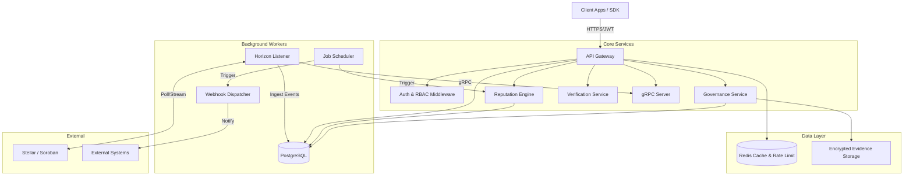

# Backend Architecture

This document describes the architectural design of the Credence Backend, a system for decentralized reputation and identity verification on the Stellar network.

## 1. System Overview

The Credence Backend is a modular system composed of an API Gateway, background workers for blockchain event ingestion, and core service logic for reputation and governance. It uses PostgreSQL as the primary data store and Redis for caching, distributed rate limiting, and health monitoring. Internal services communicate via gRPC for high-performance, secure data exchange.

### High-Level Architecture



### Deployment Architecture

```mermaid
graph TD
    LB[Load Balancer / Ingress] --> Service[API Service (K8s Pods)]
    
    subgraph "Kubernetes Cluster"
        Service
        Worker[Worker Service (K8s Pods)]
        Kustomize[Kustomize Manifests]
    end
    
    Service -->|Read/Write| DB[(Cloud SQL / RDS)]
    Worker -->|Read/Write| DB
    
    Service -->|Cache/Limit| Redis[(Managed Redis)]
    Worker -->|Cache/Limit| Redis
    
    Worker -->|RPC| Horizon[Stellar Horizon API]
```

## 2. Core Components

### 2.1 API Gateway (Express)
The entry point for all client interactions, exposing a RESTful API versioned at `/api/v1` and an internal gRPC server.
- **Responsibilities:**
  - Request validation (Zod) and routing.
  - **Authentication:** JWT Bearer token authentication.
  - **RBAC:** Role-Based Access Control (Admin, Verifier, User, Public).
  - **Rate Limiting:** Redis-backed distributed rate limiting with tier-based quotas (Free, Pro, Enterprise).
  - **Observability:** X-Request-ID / X-Correlation-ID tracing, audit logging, and detailed health checks (DB, Redis, Horizon).
- **Internal Comms:** gRPC server facilitating secure service-to-service communication (e.g., fetching trust scores internally).

### 2.2 Horizon Listener
A set of background services responsible for synchronizing off-chain state with the Stellar blockchain.
- **Responsibilities:**
  - **Bond Listener:** Monitors for `BondCreated` events.
  - **Slash Listener:** Monitors for contract-emitted slashing events.
  - **Withdrawal Listener:** Monitors for bond withdrawal transactions.
  - **Attestation Listener:** Monitors for `Attested` and `Revoked` events.
  - **Sync Logic:** Reconciles on-chain state with DB using an automated connection pool.
  - **Triggers:** Automated cache invalidation and score recalculation upon event detection.

### 2.3 Reputation Engine
The core logic for calculating trust and risk scores.
- **Trust Scoring:** Computes a 0-100 score based on Bond Score, Attestation Score, and Identity longevity.
- **Risk Scoring:** Computes risk metrics based on slash history, revocation rates, and bond volatility.
- **Execution:** 
  - Real-time via API.
  - Batch via **Scheduled Score Snapshot** jobs (cron/worker).

### 2.4 Governance Service
Manages the decentralized decision-making and dispute process.
- **Features:**
  - **Disputes:** Full lifecycle management (submit, validate, resolve).
  - **Arbitration Logs:** Immutable tracking of governance events and outcomes.
  - **Multi-Signature Service:** Proposal management (create, sign, execute, expire) with configurable thresholds.
  - **Evidence Management:** Secure handling of dispute evidence via **Encrypted Storage**.

### 2.5 Verification Service
Handles the generation of cryptographic proofs for identity data.
- **Features:**
  - Generates **Hash-anchored proof packages** using Canonical JSON.
  - **RSA Signing:** Optional cryptographic signing of identity snapshots.
  - **Integrity:** Tamper detection and expiry validation for all proofs.

## 3. Data Architecture

### 3.1 PostgreSQL Schema
The relational database serves as the source of truth for off-chain data and system state.

| Domain | Table | Description | Relationships |
|--------|-------|-------------|---------------|
| **Identity** | `identities` | Core identity record (address, created_at). | Primary Key |
| | `bonds` | Current bond state (amount, slashed_amount, duration). | 1:1 with `identities` |
| **Reputation** | `score_history` | Time-series data of trust scores. | N:1 with `identities` |
| | `attestations` | Linked third-party verifications (type, value, source). | N:1 with `identities` |
| | `risk_scores` | Calculated risk metrics. | 1:1 with `identities` |
| **Governance** | `disputes` | Dispute records and status. | N:1 with `identities` (defendant) |
| | `votes` | Votes cast on disputes/proposals. | N:1 with `disputes` |
| | `arbitration_logs`| Immutable log of governance events. | N:1 with `disputes` |
| | `slash_requests` | Internal requests to slash a bond. | N:1 with `identities` |
| | `slash_events` | Recorded on-chain slash events. | N:1 with `identities` |
| **System** | `audit_logs` | Immutable log of sensitive admin/governance actions. | N:1 with `users` (actor) |
| | `webhooks` | Registered webhook endpoints, events, and HMAC secrets. | N:1 with `users` (owner) |
| | `subscriptions` | API keys, tier assignments, and usage quotas. | 1:1 with `users` |
| | `users` | System users with RBAC roles. | Primary Key |

### 3.2 Redis Cache & state
- **Trust/Bond Cache:** TTL-based storage for API responses.
- **Rate Limit Store:** Distributed hit counters for global quota enforcement.
- **Namespacing:** Clear separation (e.g., `trust:`, `bond:`, `ratelimit:`, `audit:`).

## 4. Configuration & Security

### 4.1 Environment Variables
The application requires the following key environment variables, validated at startup via a centralized Config module.

| Variable | Description | Required |
|----------|-------------|----------|
| `DATABASE_URL` | PostgreSQL connection string | **Yes** |
| `REDIS_URL` | Redis connection string | **Yes** |
| `JWT_SECRET` | Secret for signing/verifying JWTs | **Yes** |
| `ALLOWED_ORIGINS` | Comma-separated CORS allowlist | **Yes (Prod)** |
| `HORIZON_URL` | Stellar Horizon API endpoint | **Yes** |
| `CONTRACT_ADDRESS`| Soroban/Horizon core contract address | **Yes** |
| `GRPC_TLS_CERT` | Certificate for secure gRPC communication | No (Optional) |
| `SIGNING_KEY_PRIVATE`| RSA Private key for identity proofs | **Yes** |
| `ENCRYPTION_KEY` | Key for encrypted evidence storage | **Yes** |

### 4.2 Security & Integrity
- **Authentication:** JWT for clients, Shared Secret Interceptors for gRPC.
- **Data Integrity:** Canonical JSON formatting and SHA-256 hashing for proofs.
- **Persistence:** Idempotent database migrations and versioning.
- **Observability:** Detailed readiness/liveness probes for K8s orchestration.

## 5. Workflows & Data Flow

### 5.1 Chain-to-DB Synchronization
1. **Event:** Stellar network emits `BondCreated` or `Slashed`.
2. **Detection:** Specific Listener (Bond/Slash) detects event via polling or streaming.
3. **Persistence:** Repository upserts data to Postgres (`identities`/`bonds`/`slash_events`).
4. **Invalidation:** Listener triggers Redis cache purge for the affected address.
5. **Propagation:** (Optional) Webhook dispatcher sends HMAC-signed payload to external URLs.

### 5.2 Internal Score Retrieval (gRPC)
1. **Request:** A separate microservice calls `GetTrustScore` via gRPC.
2. **Auth:** gRPC server validates the shared secret in metadata.
3. **Execution:** Server fetches current score from DB/Engine and returns via protobuf.

## 6. Future Roadmap
- **Bulk Verification:** Batch processing API for enterprise users.
- **Developer SDK:** Fully typed TypeScript/JavaScript client library (Planned/WIP).
- **Advanced Monitoring:** Unified Prometheus/Grafana dashboard for business & infra metrics.
